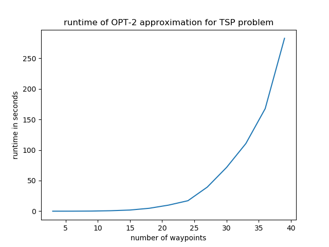
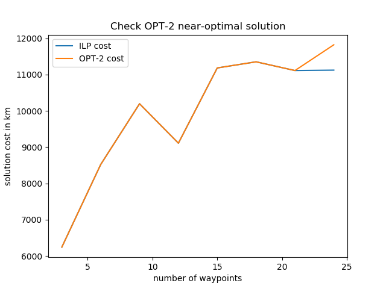

# mTSP-work
keeping track of algorithm implementations for mTSP (multiple travelling salesmen)

### Problem statement
Given `N (N >= 1)` salesmen and `C (C >= 4)` cities that needs to be visited, find an optimal route for each saleman such that meet the following requirements:
  1. each city is visited exactly once
  2. all salesmen start and finish their route at the same city
  3. the total distance of each tour is the shortest distance that meets the above requirement
Given that (1) the salesmen can visit any city from any other cities in the network; and (2) each salesman may have their own limitation in terms of resources (e.g., salesman i-th can only cover d distance).

This type of problem is considered to be NP-hard. Read more on the problem [here](https://en.wikipedia.org/wiki/Travelling_salesman_problem) and [here](https://neos-guide.org/content/multiple-traveling-salesman-problem-mtsp)

---
# Approaches
There are several ways to solve mTSP, but one basic solution is to build from the solution of the TSP (travelling saleman) problem, where `N = 1`.

---
## Approaches for TSP problem
The following list the algorithms included in this repository for solving the TSP problem

### Exact solution using Dynamic Programming (DP)
The details of the algorithm can be found [here](https://en.wikipedia.org/wiki/Held%E2%80%93Karp_algorithm#:~:text=The%20Held%E2%80%93Karp%20algorithm%2C%20also,to%20find%20a%20minimum%2Dlength)

Since this algorithm seeks to find the exact solution, its runtime is still non-polynomial.  Out of all the algorithm included in this repository, this is the most inefficient algorithm in terms of runtime.  The following graph presents the runtime of the algorithm as the sample size (number of cities) increases

### Exact solution using ILP (linear Integer Programming)
The details of the algorithm can be found [here](https://python-mip.readthedocs.io/en/latest/examples.html)

Again since the algorithm seeks to find the exact solution, its runtime remains non-polynomial.  However, this approach is significantly faster the DP approach and can solve instances with larger sample sizes.  The following graph presents the runtime of the algorithm as the sample size increases

### Approximation solution using OPT-2 algorithm
The details of the algorithm can be found [here](https://en.wikipedia.org/wiki/2-opt)

The algorithm seeks to find near-optimal solution.  This improve the runtime significantly.  However, the algorithm's performance (in terms of finding the near-optimal and optimal solution) relies on an initial randomized route.  The algorithm can get stuck in a non-near-optimal pitfall and has no mechanism to get out of that pitfall.  To decrease the algorithm sensitivity to randomization, the `opt2` solver is run 10 times with 10 different initial randomized routes.  The following graph presents the runtime of the algorithm as the sample size increase. 

Additionally, the following graph investigate the solutions output by this algorithm when compare to the exact solution (output by ILP solver)

---
## Approaches for mTSP problem
The following list the algorithms included in this repository for solving the mTSP problem
**To be updated**
