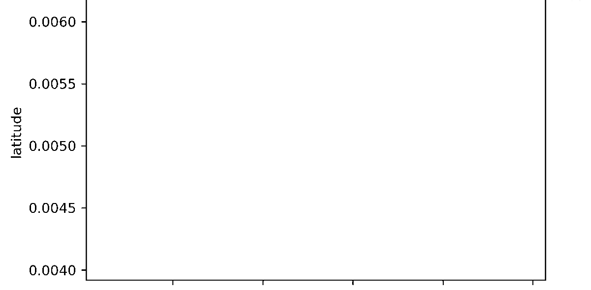

# Initial water sampling routes for team of robots
The final implementation to create the sampling route for each robot utlized [Google OR-tools](https://developers.google.com/optimization).  However, there are other solvers in this repository that solve the mTSP and TSP; `solvers_examples.py` includes examples of how to use these solvers.

Additionally, this repository includes a simulation to generate sampling points within a given rectangle boundary. 

The task of routing a team of robot for water sampling in this repository is modeled after the [multiple travelling salesmen problem](https://neos-guide.org/content/multiple-traveling-salesman-problem-mtsp) (mTSP).  The formulation of the task is summarized below

Given `m (m >= 1)` robots and `N (N >= 4)` sampling points that need to be visited, find an optimal route for each robot that meet the following requirements:
  1. each sampling point is visited exactly once
  2. all robots start and finish their route at the same depot
  3. each robot has its own limitations including:
      * maximum travel distance per tour and 
      * maximum number of samples per tour
  4. each robot can visit any sampling point from any other points on the site of interest
  5. the total distance of each tour is the shortest distance that meets the above requirement

### Mathematical formulation
Consider a graph `G=(V,E)` where `V` is the set of `N (N ≥ 4)` nodes, and `E` is the set of edges between these nodes. The depot is encoded as node 1. There are `m (m ≥ 1)` agents all starting and finishing their tours at the depot.

Objective function


Where


Constraints


* Constraint (2) ensures that all agents start at a depot (i.e., exactly `m` agents start at the depot, usually denoted as node 1).
* Constraint (3) ensures that all agents finish at the depot.
* Constraint (4) ensures that each node is visited exactly one.
* Constraint (5) ensures that the total distance traveled for each agent does not exceed the agent's distance capacity.
* Constraint (6) eliminates subtours, or solutions that do not visit all points.

Additionally, for this project, points of interest are separated for each type of vehicle before feeding them into mTSP solvers.  More sepecifically, boat robot is assigned points that are spread out over the entire site; the rest of the sampling points are assigned to drones.  The reason for this is that different type of vehicle (in this case boat vs. drone) has different sampling agenda that cannot be easily formulated into a mathematical constraint for the solver. The method of splitting sampling points is described in `Implementation` section.

# Requirements
```
python=3.10.2
matplotlib=3.5.1
numpy=1.22.3
scipy=1.7.3
mip=1.13.0  # if you want to run mixed-integer solver
```

Google OR-tools installation
```
python -m pip install --upgrade --user ortools
```

# Implementation
### Routing task solver
The solver implementation relies on Google OR-tools; tutorials on how to use the tool for this problem can be found [here](https://developers.google.com/optimization/routing).  However, this implentation incorporates two constraints (total distance and maximum number of sampling points per tour) instead of one (like the examples on Google's tutorials page).  Additionally, Goole OR-tools solver uses an approximation algorithm instead of an exact algorithm.  The result of the solver depends on the heuristic method used.  This implementation uses [guided local search](http://en.wikipedia.org/wiki/Guided_Local_Search) for solutions exploration because the method has a custom time limit for running and can get out of local optima.  Google OR-tools provides other [local search options](https://developers.google.com/optimization/routing/routing_options#local_search_options).

The solver used in the final result is for multiple vehicle problem.  However, since mTSP is just an extension of TSP, the solver can also solve for TSP.  The implementation requires that coordinates of sampling points in the area of interest be in the tuple format. In the case of this specific application, coordinates are in `(lat, lon)`.  The solver can take other forms of coordinates.  Additionally, user must supply their own function for computing distance between points.  The `utils.py` provides 3 distance functions: one for computing Euclidean distance between `(x, y)` coordinates, one for computing `lat-lon` distance in km, and one for computing `lat-lon` distance in meters.  `lat-lon` distance functions use the assumption that the Earth's radius is 6371 km (or 6371000 meters); this is not the exact measurement and may introduce some numerical deviation from the actual distance.  Supply your own calculation in a custom function if you seek a more accurate measurement.

This solver will only take in distance matrix and vehicle limit values in integer format.  The implementation will still take distance function and distance matrix that output/have float values, but the distance values will be automatically be rounded up to the next integer.  Please consider this when providing distance matrix and implementing your own distance function.  This solver looks for a solution that covers all given points of interest.  If no such solution exists, it is considered to have no solution.  The solver will not drop points for you to create a solution.  Please consider this when providing points of interest and vehicle's distance limit.

Since different types of robot/vehicle are subjected to different set of sampling points, two solvers were used in the final workflow/result: one for drone and the other for boat.

### Sampling points simulation
The sampling point simulation was created to create sampling points for testing the routing task solver's behaviors.  Given a rectangle boundary in coordinate format (in this case, in `lat-lon` format) that is defined by the `min_point = bottom left of the rectangle` and `max_point = top right of the rectangle`, the number of sampling points, distance function to calculate the distance beween points, the simulation outputs (1) a set of "random" sampling points such that the points spread out over the entire area of interest, and (2) a set of sampling points for the surface vehicle (a boat, in this specific application).

(1) The set of "random" sampling points is sampled/created using [Sobol sampling method](https://en.wikipedia.org/wiki/Sobol_sequence?fbclid=IwAR2Ox5HG1ips06baMlu4NbSiTC5oXCOQqFhn3RG7x3LYnTOd5kx0L5A1ilM).  The implementation of this algorithm is from Scipy (v1.7.3+).  Additionally, since this implementation can only output numbers of sampling points that are powers of 2, and sometimes this is not the case for what is needed, some randomization is introduced to the sampled outputs.  More specifically, given that we want `k` sampling points in the area of interest, where `k` is any integer and `k > 0`, Sobol is used to sample `N` samples where `N` is a power of 2 and `N >= k`.  If `N > k`, randomization (with a uniform probability) is used to randomly pick `k` points to be in the final set of sampling points.

(2) The set of sampling points for the surface vehicle (a boat, in this case) is chosen from the set of sampling points in (1).  Points in set (2) are chosen by first dividing the area of interest into equal-sized rectangles (the number of rectangles is determined by user and how many sampling points they want the boat/surface vehicle to have).  Next, the centroids of the smaller rectangles are determined using the following formula `centroid_lat = (corner1_lat + corner2_lat) / 2` and `centroid_lon = (corner1_lon + corner2_lon) / 2`.  These formula disregard the curvature of the Earth in computing the centroid's lat-lon coordinate.  The reason for this is that due to the capacity and resource constraints of the robots, it is assumed the size of the area of interest is relatively small enough to be considered as a flat surface.  Once the coordinates of the centroids are known, sampling points for surface vehicle are determined by choosing points in (1) that are closest to the centroids.

The rest of the sampling points (those that aren't assigned to the surface vehicle) will be assigned to the other type of vehicle.  The gif below shows an example of the simulation and its intermediate steps to produce sampling points for each type of vehicle.



# How to run the code 
The final workflow and example are presented in `main.py`.  The example used the sampling point simulation to create a set of sampling points and used the `MTSP_BASIC` solver to get the routing for each vehicle.  There are 5 required paramteres for the sampling simulation, details below.  

```
### Boundary coordinates of site of interest (Ottway site, specifically) in (lat, lon) format
bot_left = (34.784027, -76.571366)
top_right = (34.786204, -76.569048)

# number of sampling points wanted for sampling point simulation to generate
# the number of sampling points for surface vehicle and how the area of interest should be divided (in terms of how many rows and columns)
#   num_rect = (nrows - 1) x (ncols - 1)
#   num_surface_vehicle_sampling_points = num_rect
# the distance function used to compute distance between points of interest
num_samples = 20
nrows, ncols = 5, 3
distFunc = longLatDistM
```

There are 5 required paramteres for the sampling simulation, details below.  Note that the numbers for distance capacity for each vehicle can be in any unit, **but they have to be integers and in uniform unit**

```
# the distance capacity of each vehicle. 
# number of vehicles for a solver
# the set of points of interest for the solver
# the distance function used to compute distance between points of interest
# coordinate of the depot
boat_dist = 3000
drone_dist = 3000
ndrones = 3
points_of_interest = samplingPointSim output
distFunc = longLatDistM
depot = (lat, lon)
```

There are other optional parameters, details below.  Note that the sampling capacity for each vehicle includes the depot, and **capacity constraints and demand/available samples at each point of interest must be integers**

```
# Sampling capacity of each vehicle
# A randomization seed to create reproducible results
# Maximum time limit (in second) for the solver to search for solution
# Demand or available samples at each points of interest
single_drone_cap = 6
seed = 66
time_limit = 30
demands = List(int)
```

In this specific application, it is assumed that only one sample is available at each point of interest; this assumption can be change by providing the exact number of available samples to solver using `demands` parameter.  If vehicle capacity is not supplied, vehicles' capacities will be populated to assure that a solution exists, given that a solution exists for the distance constraint.

The block below shows an example of what the solver will print out to terminal.  Note that this output is for debugging purposes and it does not include the print out for sample loadings even though sample loading is a constraint for the solver and is being solved alongside distant constraint.  The solver returns a solution in coordinate-based format along with total distance traveled

```
Route for vehicle 0: 
 14 ->  0 ->  10 ->  1 ->  2 ->  8 ->  4 ->  12 ->  13 ->  3 -> 14
Distance of the route: 7500km

Route for vehicle 1: 
 14 ->  7 ->  6 ->  11 ->  9 ->  5 -> 14
Distance of the route: 8247km

Maximum of the route distance: 8247km
Total distance traveled by all vehicles: 15747 km
```

The image below visualizes the planned tour for each vehicle with a setting of 3 aerial vehicles (blue) and 1 surface vehicle (orange) in coordinate-based format


# Reference
```
@software{ortools,
  title = {OR-Tools},
  version = {7.2},
  author = {Laurent Perron and Vincent Furnon},
  organization = {Google},
  url = {https://developers.google.com/optimization/},
  date = {2019-7-19}
}
```

# Citation
```
@software{Initial_Water_Sampling_Routes_for_Team_of_Robots_2022,
  author = {Anh Nguyen},
  month = {04},
  title = {{Initial Water Sampling Routes for Team of Robots}},
  url = {https://github.com/anguyen216/mTSP-work},
  version = {0.0.1},
  year = {2022}
}
`
